<h4 class="center">Краткая информация о работе организации:</h4>

<iframe src="https://drive.google.com/file/d/1pOHfno4UPrLlMxugXK9uyyRDv1AAJHP9/preview" width="100%"
    height="480"></iframe>

<b><i>23 августа 2017 года</i></b> ветераны и младшие поколения сталинградцев приняли участие и возложили цветы к
    «Вечному Огню» Памятнику жертв Царицына – Сталинграда.

    <a href="img/23.08.2017/1.jpg" target="_blank">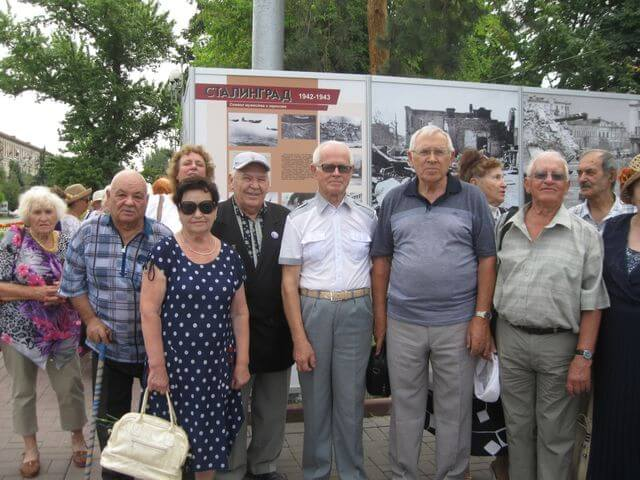</a>

Выступил на митинге от ВОО «Дети Сталинграда» «Почётный ветеран» организации, достойнейший Представитель «Жителей
    осаждённого Сталинграда» Коняхин Клим Викторович.

    <a href="img/23.08.2017/2.jpg" target="_blank">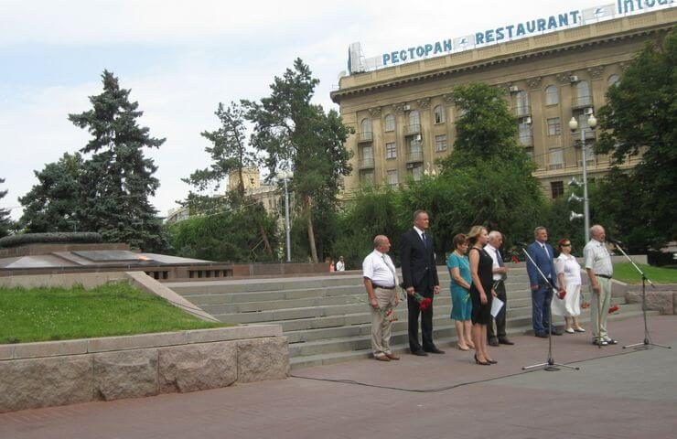</a>

 

<b><i>22 августа 2017 года</i></b> в большом зале музея-заповедника «Сталинградская Битва» проведено «Собрание
    сталинградских поколений», посвящённое трагическим событиям 23 августа 1942 года – варварской бомбардировке,
    разрушении города и гибели жителей и защитников осаждённого Сталинграда.

    <a href="img/22.08.2017/1.jpg" target="_blank">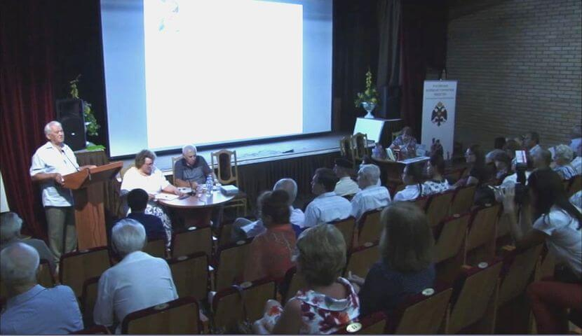</a>

В собрании приняли участие:

а) «Почётные ветераны» и члены Президиума ВОО «Дети Сталинрада»,

    <a href="img/22.08.2017/2.jpg" target="_blank">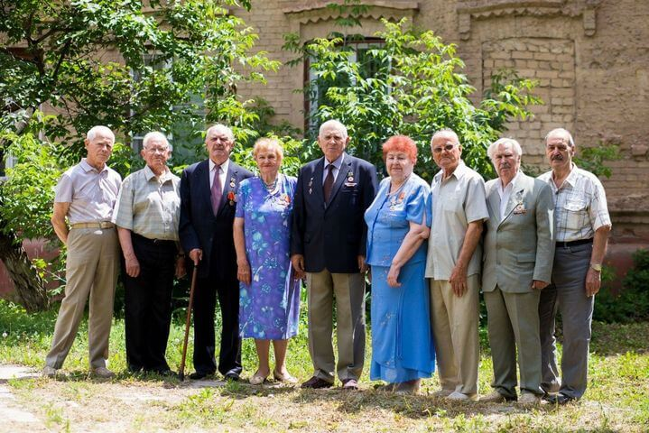</a>

б) Представители Секции «Поколения сталинградцев» ВОО «Дети Сталинграда»,

в) Учредители Общественного Объединения «Родина-Сталинград» (решение от 31.10.2014г.),

г) Приглашенные соратники и единомышленники:

<b><i>Туров Владимир Семёнович</i></b>, Президент клуба «Сталинград», участник Сталинградской битвы, полковник (в
    отставке),

<b><i>Ростовщиков Валерий Александрович</i></b>, Герой России, Уполномоченный по правам человека в Волгоградской
    области,

    <a href="img/22.08.2017/3.jpg" target="_blank">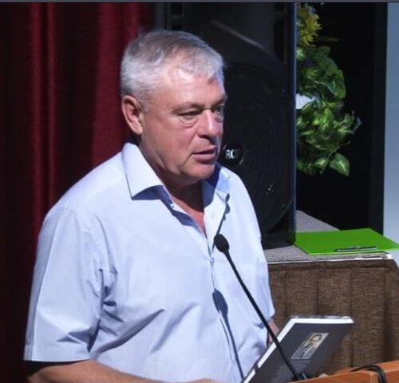</a>

<b><i>Спорова Татьяна Викторовна</i></b>, Заместитель начальника Госпиталя ветеранов войн.

<b><i>Гончаров Алексей Олегович</i></b>, и.о. Генерального директора , первый Заместитель – Главный инженер завода
    «Ахтуба»,

<b><i>Кантемиров Александр Валентинович</i></b>, заместитель Генерального Директора завода «Ахтуба»,

<b><i>Шашко Нина Викторовна</i></b>, Директор Волгоградской областной библиотеки им. Горького и другие уважаемые
    приглашённые, активно поддерживающие ветеранов – сталинградцев.

На «Собрании» 22 августа 2017 года был представлен (анонсирован) показ программы МТВ «Сталинградский дневник», где
    участвуют живые свидетели событий обороны Сталинграда. (Продюссер – Сокирко О.А., тележурналист Зеленская Д.А.).

На «Собрании» принято решение:

<iframe src="https://drive.google.com/file/d/0BwxC13B8VsoASnU1UjNyS2s3MTA/preview" width="100%" height="480"></iframe>

«Обращения» к В.В.Путину, Д.О.Рогозину, В.Р.Мединскому подготовлены и направлены адресатам 27 августа 2017 года.

 

<b><i>20 февраля 2017 года</i></b> по инициативе Руководителя секции «Поколение Сталинградцев» ВОО «Дети Сталинграда»
    Галины Викторовны Егоровой с доброй поддержкой Директора библиотеки Нины Викторовны Шашко и Главного Редактора АиФ
    НП Натальи Андреевны Гладкой проведено собрание сталинградских поколений в библиотеке им.Горького.

Тема: <strong>«Женщина – Ангел Сталинградской Победы»</strong>.

    

На собрании в прямом общении ветераны поделились своими воспоминаниями с участниками и передали в дар библиотеке свои
    «издания»:

<ul>
    <li>Панченко Ю.Н. «163 дня на улицах Сталинграда»,</li>
    <li>Степанов Б.В. «Сердце болит»,</li>
    <li>Мамонтов В.И. «Дела минувших дней»,</li>
    <li>Дубоносов Г.А. «Судьба Сталинградца»,</li>
    <li>Егорова Г.В. «Сталинградское детство»(автор сборника воспоминаний).</li>
</ul>

Младшие участники собрания задали очень важные и удивительно разумные вопросы ветеранам, получили исчерпывающие
    ответы. Все были удовлетворены и довольны. Форма проведения, уважительные взаимоотношения всех участников собрания
    (видеозапись – в «Библиотеке Памяти» ВОО «Дети Сталинграда»), добрая заинтересованность участников – наглядный
    пример достойного <strong><i>Диалога</i></strong> и настоящего <strong><i>Патриотизма</i></strong>.

 

<ul>
    <li>ведётся работа по реализации Проектов и Программ с приглашением для непосредственного участия заинтересованных
        лучших представителей сталинградских поколений;</li>
    <li>предложения ветеранов-сталинградцев по созданию эффективной системы взаимодействия "ветераны-власть-общество",
        по подготовке и проведению празднования в юбилейные даты Сталинградской Победы и Победы в Великой Отечественной
        войне, а также другие конкретные конструктивные предложения были представлены в Волгоградскую Областную Думу,
        Волгоградскую Городскую Думу и Администрацию Губернатора (письменно и с дополнительными пояснениями на
        "приёмах"). Устные обещания "рассмотреть" и "обсудить" совместно с ветеранами получены, но в дальнейшем никаких
        продвижений нет;</li>
    <li>детальная (документальная) информация о деятельности организации может быть предоставлена заинтересованным
        организациям и гражданам города-героя исключительно в интересах доброго позитивного сотрудничества для
        реализации <a href="goals.html" class="link">Главных Целей и Задач</a>;</li>
    <li>наиболее важная информация о деятельности будет представляться на настоящем Сайте;</li>
    <li>все вопросы, связанные с организацией встреч, бесед, интервьюирования ветеранов- членов организации предлагается
        рассматривать через Президиум ВООВ "Дети Сталинграда".</li>
</ul>

Для реализации Целей и Задач, утверждённых «Кодексом Сталинградца», в организации разработан и реализуется постоянно
    действующий проект «Сбережём Честь и Славу Сталинграда».

Автор проекта-руководитель организации Геннадий Алексеевич Дубоносов.

Основные организаторы и исполнители Члены Президиума – Анатолий Андреевич Ганжа, Валентина Николаевна Весова, Людмила
    Александровна Попова, члены секции «Поколение Сталинградцев»- руководитель секции Галина Викторовна Егорова,
    Светлана Анатольевна Палатова, Людмила Владимировна Друзяка, Максим Владимирович Евсиков, Дмитрий Жемчужнов и др.

Реально к работе по Проекту привлекаются многие ветераны из секции «Ветераны осаждённого Сталинграда», работающие на
    предприятиях и в организациях, студенты ВУЗов и колледжей, учащиеся лицеев и школ из секции «Поколения
    Сталинградцев». Как правило- это лучшие представители организации «Дети Сталинграда».

Проект «Сбережём Честь и Славу Сталинграда» включает в себя уже действующие «Программы» и вновь запускаемые по мере
    их готовности «созревания», для работы по конкретным направлениям и мероприятиям.

Так с января 2015 года действуют:

1. Программа «Связь Сталинградских поколений», в рамках которой подготовлены и проведены конкретные мероприятия: 
    Встречи: ветераны защитники Сталинграда; 
    ветераны- жители осаждённого Сталинграда со студентами ВУЗов, учащимися школ, лицеев. 

Так, например, были проведены накануне 73-годовщины Сталинградской Победы встречи-беседы с защитниками Сталинграда
    Ананьевым Владимиром Федоровичём,

    

        <button type="button" data-bs-target="#carouselExampleIndicators1" data-bs-slide-to="0" class="active"
            aria-current="true" aria-label="Slide 1"></button>
        <button type="button" data-bs-target="#carouselExampleIndicators1" data-bs-slide-to="1"
            aria-label="Slide 2"></button>
    

    

        

            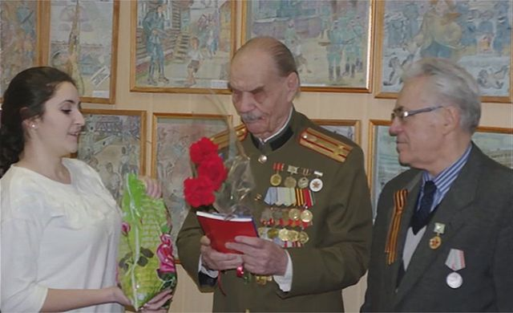
        

        

            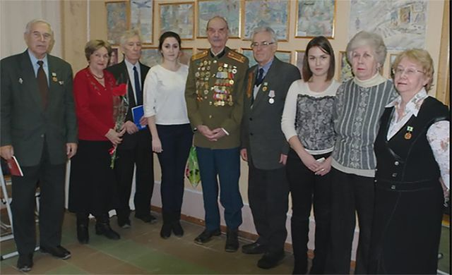
        

    

    <button class="carousel-control-prev" type="button" data-bs-target="#carouselExampleIndicators1"
        data-bs-slide="prev">
        
        Previous
    </button>
    <button class="carousel-control-next" type="button" data-bs-target="#carouselExampleIndicators1"
        data-bs-slide="next">
        
        Next
    </button>

с защитником Сталинграда Жилкиным Василием Григорьевичом.

    

        <button type="button" data-bs-target="#carouselExampleIndicators2" data-bs-slide-to="0" class="active"
            aria-current="true" aria-label="Slide 1"></button>
        <button type="button" data-bs-target="#carouselExampleIndicators2" data-bs-slide-to="1"
            aria-label="Slide 2"></button>
    

    

        

            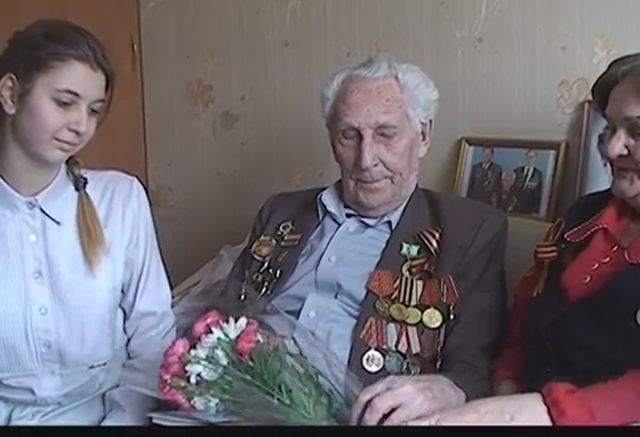
        

        

            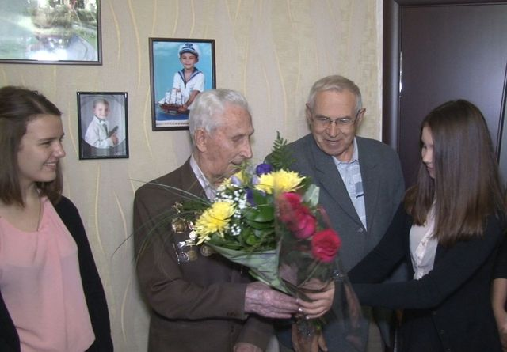
        

    

    <button class="carousel-control-prev" type="button" data-bs-target="#carouselExampleIndicators2"
        data-bs-slide="prev">
        
        Previous
    </button>
    <button class="carousel-control-next" type="button" data-bs-target="#carouselExampleIndicators2"
        data-bs-slide="next">
        
        Next
    </button>

Во всех, проводимых ВООВ «Дети Сталинграда» мероприятиях, всегда участвуют представители младших поколений
    сталинградцев-волгоградцев и это отражено на наших видео и фотографиях.

Проведены собрания представителей сталинградских поколений 4 февраля 2015 года

    

        <button type="button" data-bs-target="#carouselExampleIndicators3" data-bs-slide-to="0" class="active"
            aria-current="true" aria-label="Slide 1"></button>
        <button type="button" data-bs-target="#carouselExampleIndicators3" data-bs-slide-to="1"
            aria-label="Slide 2"></button>
        <button type="button" data-bs-target="#carouselExampleIndicators3" data-bs-slide-to="2"
            aria-label="Slide 3"></button>
        <button type="button" data-bs-target="#carouselExampleIndicators3" data-bs-slide-to="3"
            aria-label="Slide 4"></button>
        <button type="button" data-bs-target="#carouselExampleIndicators3" data-bs-slide-to="4"
            aria-label="Slide 5"></button>
        <button type="button" data-bs-target="#carouselExampleIndicators3" data-bs-slide-to="5"
            aria-label="Slide 6"></button>
        <button type="button" data-bs-target="#carouselExampleIndicators3" data-bs-slide-to="6"
            aria-label="Slide 7"></button>
        <button type="button" data-bs-target="#carouselExampleIndicators3" data-bs-slide-to="7"
            aria-label="Slide 8"></button>
        <button type="button" data-bs-target="#carouselExampleIndicators3" data-bs-slide-to="8"
            aria-label="Slide 9"></button>
    

    

        

            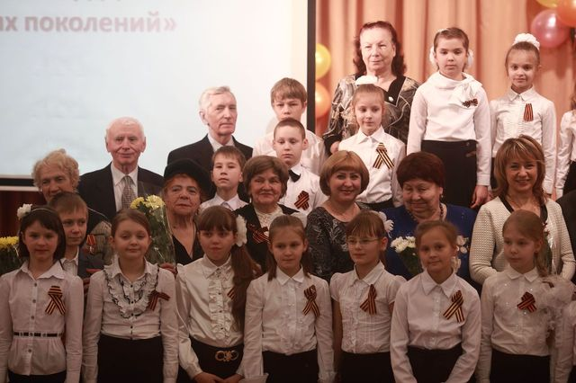
        

        

            
        

        

            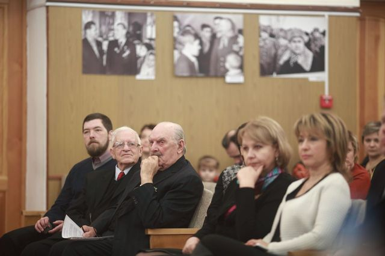
        

        

            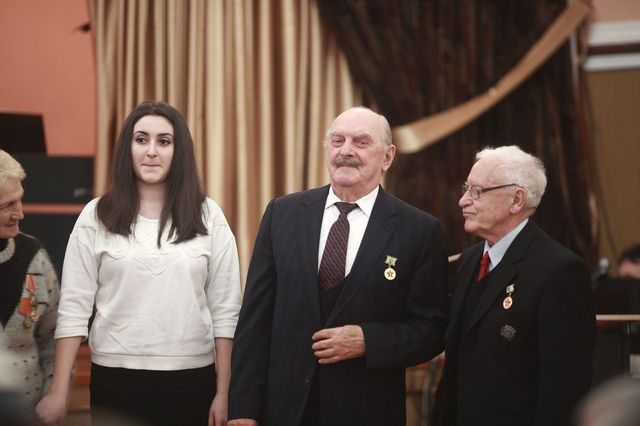
        

        

            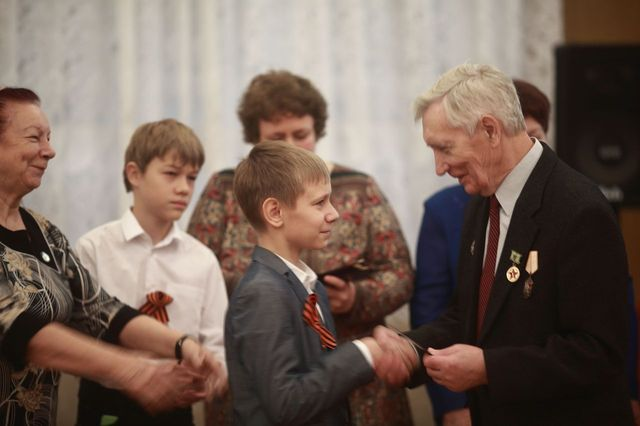
        

        

            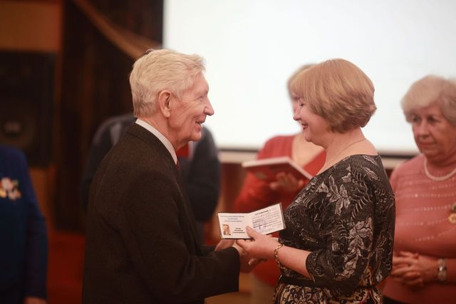
        

        

            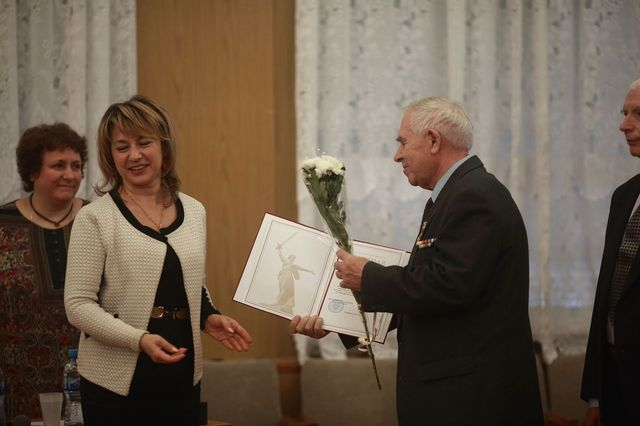
        

        

            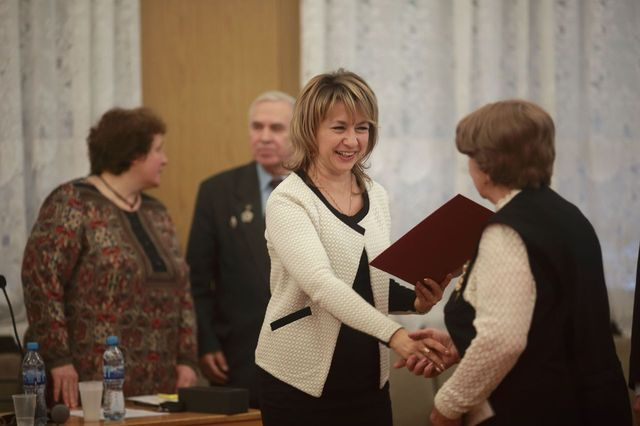
        

        

            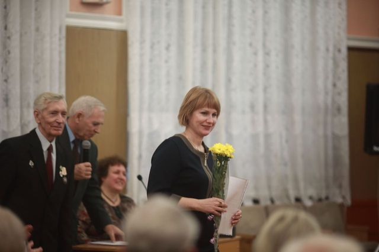
        

    

    <button class="carousel-control-prev" type="button" data-bs-target="#carouselExampleIndicators3"
        data-bs-slide="prev">
        
        Previous
    </button>
    <button class="carousel-control-next" type="button" data-bs-target="#carouselExampleIndicators3"
        data-bs-slide="next">
        
        Next
    </button>

На втором собрании 17 февраля 2016 года была представлена информация о достижениях лучших трудящихся передовых
    предприятий и были представлены итоги успешной работы ветеранов-сталинградцев из НИИ «Штиль» Александра
    Вячеславовича Камышова и Николая Акимовича Пахомова.

    

        <button type="button" data-bs-target="#carouselExampleIndicators4" data-bs-slide-to="0" class="active"
            aria-current="true" aria-label="Slide 1"></button>
        <button type="button" data-bs-target="#carouselExampleIndicators4" data-bs-slide-to="1"
            aria-label="Slide 2"></button>
        <button type="button" data-bs-target="#carouselExampleIndicators4" data-bs-slide-to="2"
            aria-label="Slide 3"></button>
        <button type="button" data-bs-target="#carouselExampleIndicators4" data-bs-slide-to="3"
            aria-label="Slide 4"></button>
    

    

        

            
        

        

            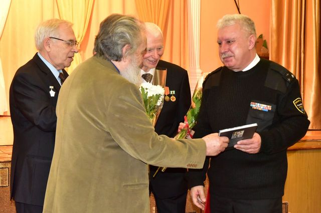
        

        

            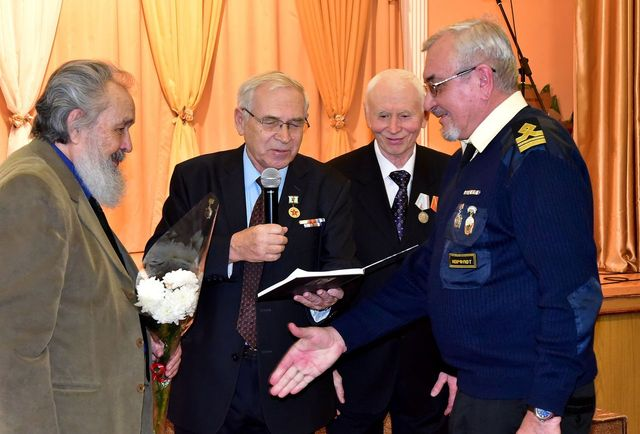
        

        

            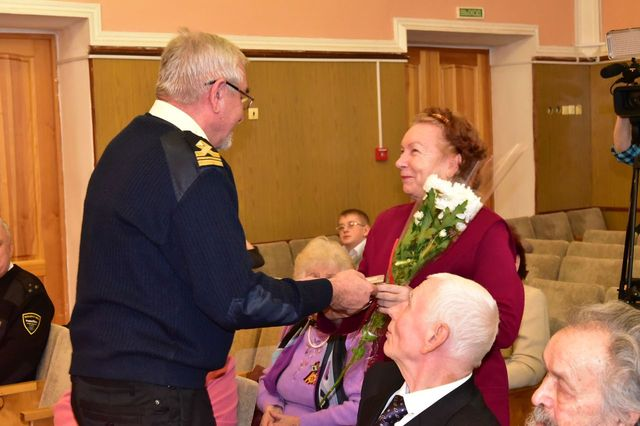
        

    

    <button class="carousel-control-prev" type="button" data-bs-target="#carouselExampleIndicators4"
        data-bs-slide="prev">
        
        Previous
    </button>
    <button class="carousel-control-next" type="button" data-bs-target="#carouselExampleIndicators4"
        data-bs-slide="next">
        
        Next
    </button>

Так же 17 февраля 2016 года проведены собрания представителей сталинградских поколений. Они посвящены Сталинградской
    Победе.

Их можно считать началом «Форума Сталинградская Победа», т.к. на них подводятся итоги деятельности организации «Дети
    Сталинграда» к очередной годовщине Победы в Сталинградской битве в воспитательно-патриотической и организационной
    работе, успехах и достижениях с поощрением лучших сталинградцев-волгоградцев.

    

        <button type="button" data-bs-target="#carouselExampleIndicators5" data-bs-slide-to="0" class="active"
            aria-current="true" aria-label="Slide 1"></button>
        <button type="button" data-bs-target="#carouselExampleIndicators5" data-bs-slide-to="1"
            aria-label="Slide 2"></button>
        <button type="button" data-bs-target="#carouselExampleIndicators5" data-bs-slide-to="2"
            aria-label="Slide 3"></button>
        <button type="button" data-bs-target="#carouselExampleIndicators5" data-bs-slide-to="3"
            aria-label="Slide 4"></button>
        <button type="button" data-bs-target="#carouselExampleIndicators5" data-bs-slide-to="4"
            aria-label="Slide 5"></button>
        <button type="button" data-bs-target="#carouselExampleIndicators5" data-bs-slide-to="5"
            aria-label="Slide 6"></button>
    

    

        

            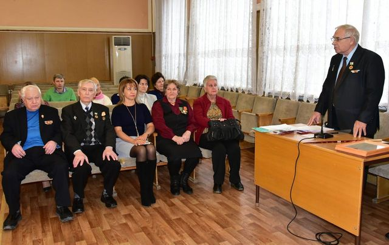
        

        

            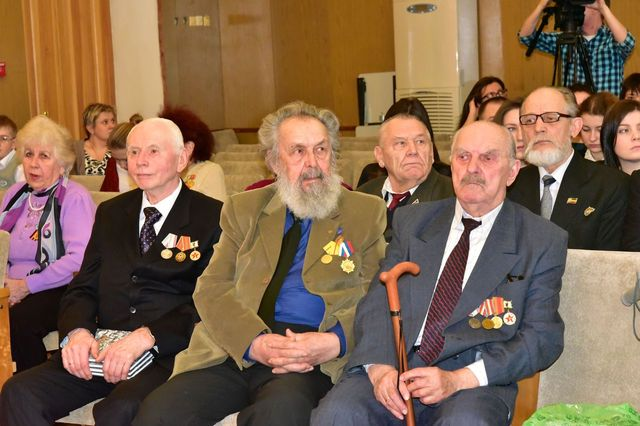
        

        

            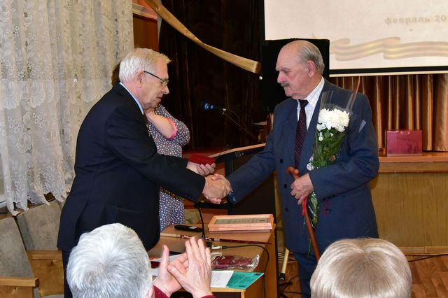
        

        

            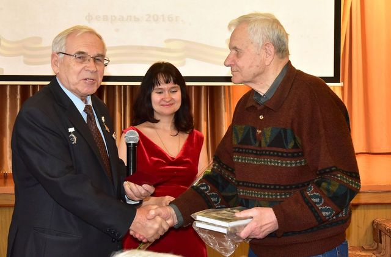
        

        

            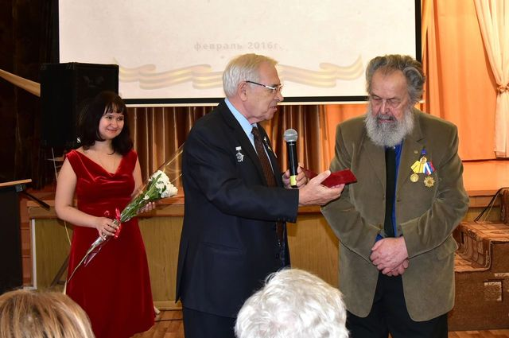
        

        

            
        

    

    <button class="carousel-control-prev" type="button" data-bs-target="#carouselExampleIndicators5"
        data-bs-slide="prev">
        
        Previous
    </button>
    <button class="carousel-control-next" type="button" data-bs-target="#carouselExampleIndicators5"
        data-bs-slide="next">
        
        Next
    </button>

И на втором собрании чётко проявляется единство и связь сталинградских поколений, где младшие тянутся к старшим:

    

        <button type="button" data-bs-target="#carouselExampleIndicators6" data-bs-slide-to="0" class="active"
            aria-current="true" aria-label="Slide 1"></button>
        <button type="button" data-bs-target="#carouselExampleIndicators6" data-bs-slide-to="1"
            aria-label="Slide 2"></button>
        <button type="button" data-bs-target="#carouselExampleIndicators6" data-bs-slide-to="2"
            aria-label="Slide 3"></button>
        <button type="button" data-bs-target="#carouselExampleIndicators6" data-bs-slide-to="3"
            aria-label="Slide 4"></button>
        <button type="button" data-bs-target="#carouselExampleIndicators6" data-bs-slide-to="4"
            aria-label="Slide 5"></button>
    

    

        

            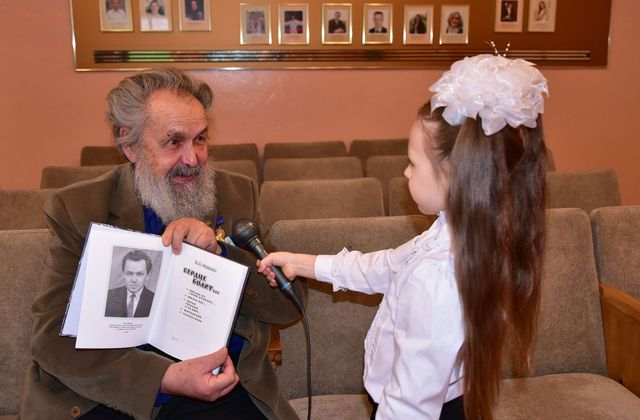
        

        

            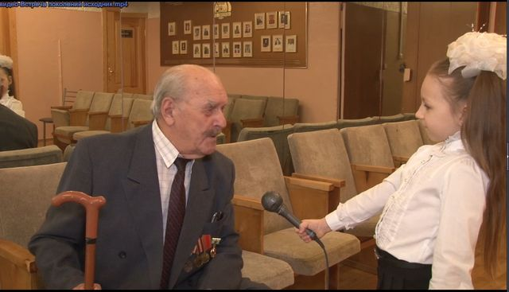
        

        

            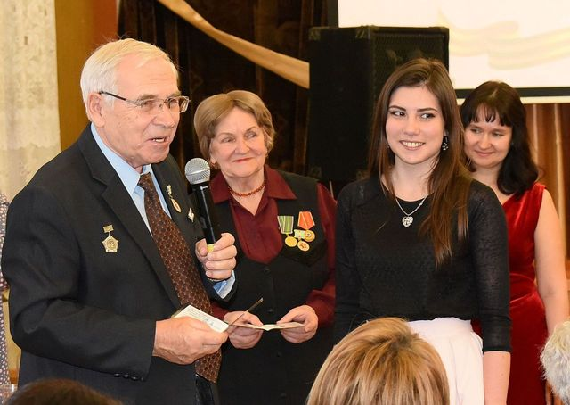
        

        

            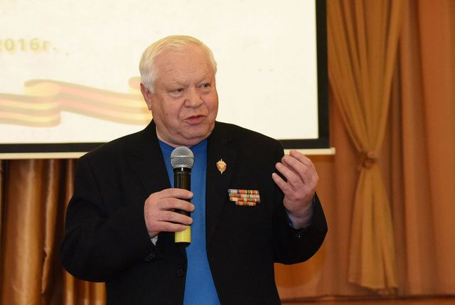
        

        

            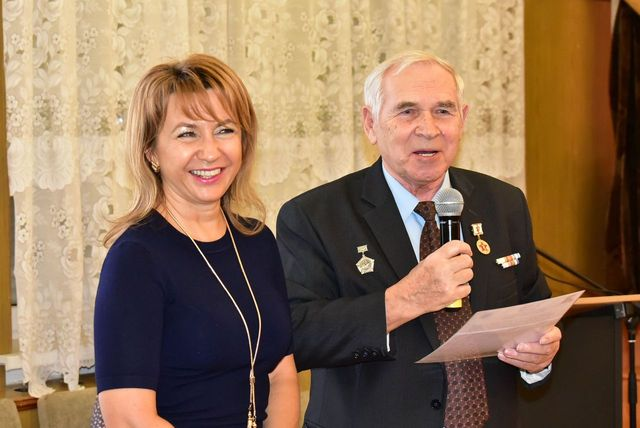
        

    

    <button class="carousel-control-prev" type="button" data-bs-target="#carouselExampleIndicators6"
        data-bs-slide="prev">
        
        Previous
    </button>
    <button class="carousel-control-next" type="button" data-bs-target="#carouselExampleIndicators6"
        data-bs-slide="next">
        
        Next
    </button>

2. Программа «Чтобы помнили…» 
    Мероприятия этой программы проводятся в школах г.Волгограда и г.Волжского, библиотеках и детских садах города.
    Ветераны, живые свидетели событий обороны Сталинграда, рассказывают младшим поколениям о трагических и героических
    событиях Сталинградской битвы, о стойкости и мужестве, о пережитом, увиденном в своём родном городе, о его
    возрождении из руин и разрухи, о своём участии в этих процессах ради жизни и процветания Отечества.

    <a href="img/26.10.2016/29.jpg" target="_blank">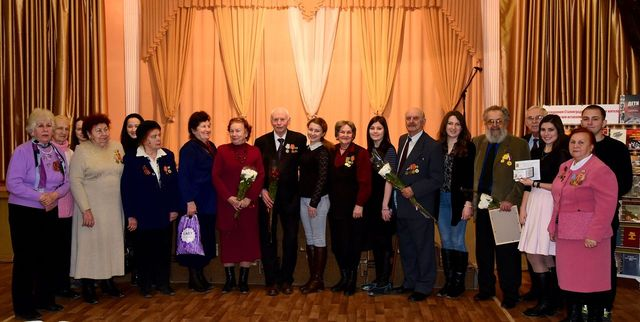</a>

Особенно активную работу в школах г. Волжского ведёт ветеран организации Нина Николаевна Чикова, а в Дзержинском
    районе города очень эффективно организовывают эту работу ветераны организации Валентина Николаевна Весова и член
    секции «Поколение Сталинградцев» Светлана Ивановна Самохвалова, заведующая библиотекой №24. Много встреч и бесед в
    учебных заведениях города проводит и «Почётный ветеран» нашей организации Владислав Иванович Мамонтов.

В составе мероприятий этой Программы проводятся также «Уроки сталинградского мужества». Основным организатором их
    является руководитель секции «Поколения Сталинградцев» Галина Викторовна Егорова и члены секции Светлана Анатольевна
    Палатова, Людмила Владимировна Друзяка, Максим Владимирович Евсиков и другие.

Такие уроки были проведены в музее русского языка им Трубачёва О.Н. центра «Олимпия» в мае 2016 года, где перед
    школьниками выступили с воспоминаниями о пережитом в Сталинграде заслуженные ветераны организации: Л.Д.Пастухова,
    Т.П.Кузьмина, В.И.Мамонтов, Ю.А.Торгашов.

    <a href="img/26.10.2016/30.jpg" target="_blank">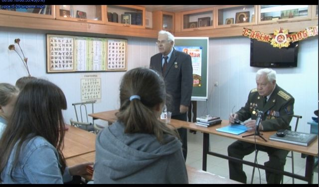</a>

Мастер-класс с окончившимися школу молодыми телерадиожурналистами провёл, на высоком профессиональном уровне и очень
    интересно, заслуженный ветеран Клим Викторович Коняхин.

    <a href="img/26.10.2016/31.jpg" target="_blank">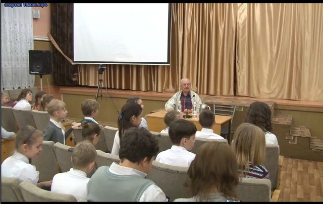</a>

Одним из важных мероприятий Программы «Чтобы помнили» была, подготовленная по инициативе руководителей организации
    «Дети Сталинграда» и Волгоградского госпиталя ветеранов войны (О.В.Кирилов, Г.А.Дубоносов, Г.В.Егорова) и
    проведённая 18 августа 2016 года встреча сталинградцев-волгоградцев, посвящённая трагическим событиям 23 августа
    1942 года в городе Сталинграде.

    <tr>
        <td style="padding: 15px">
            <h4 class="center">ВСТРЕЧА</h4>
            
Сталинградских поколений, посвящённая памяти трагических событий в городе 23 августа 1942 года

            <h4 class="center">УЧАСТНИКИ:</h4>
            
Свидетели бомбардировок города – Почётные ветераны ВООВ «Дети Сталинграда».

            
Наследники ветеранов – младшие поколения.

            
Персонал Госпиталя ветеранов войн.

            
Пациенты Госпиталя.

            
Дата и Время

            
18 августа 2016 года

            
Место проведения:

            
Актовый зал Госпиталя ветеранов войн.

Открыла «Встречу» и.о. начальника Госпиталя Ольга Станиславовна Максимова.

    

        <button type="button" data-bs-target="#carouselExampleIndicators7" data-bs-slide-to="0" class="active"
            aria-current="true" aria-label="Slide 1"></button>
        <button type="button" data-bs-target="#carouselExampleIndicators7" data-bs-slide-to="1"
            aria-label="Slide 2"></button>
    

    

        

            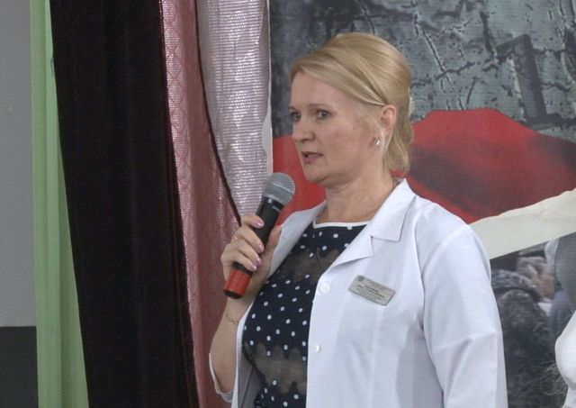
        

        

            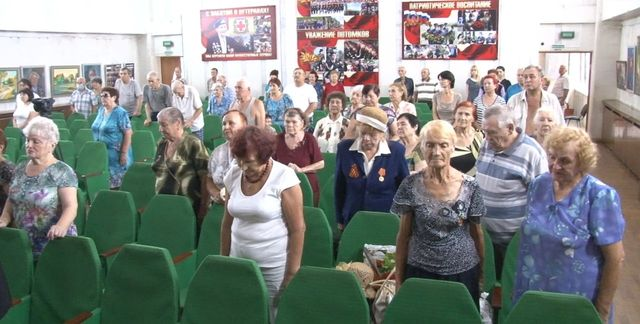
        

    

    <button class="carousel-control-prev" type="button" data-bs-target="#carouselExampleIndicators7"
        data-bs-slide="prev">
        
        Previous
    </button>
    <button class="carousel-control-next" type="button" data-bs-target="#carouselExampleIndicators7"
        data-bs-slide="next">
        
        Next
    </button>

На встрече в свободном общении «Почётные ветераны» организации «Дети Сталинграда» Юрий Николаевич Панченко, Борис
    Васильевич Степанов, Клим Викторович Коняхин, Владислав Иванович Мамонтов рассказали об увиденном и пережитом 23
    августа 1942 года и последующих днях уничтожение фашистами города в ту, в наиболее тяжёлую для населения неделю до
    29 августа, реальными свидетелями которых они были и которые они описали в своих воспоминаниях.

    

        <button type="button" data-bs-target="#carouselExampleIndicators8" data-bs-slide-to="0" class="active"
            aria-current="true" aria-label="Slide 1"></button>
        <button type="button" data-bs-target="#carouselExampleIndicators8" data-bs-slide-to="1"
            aria-label="Slide 2"></button>
    

    

        

            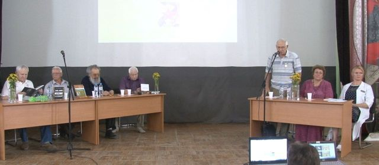
        

        

            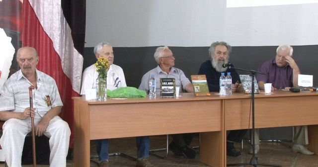
        

    

    <button class="carousel-control-prev" type="button" data-bs-target="#carouselExampleIndicators8"
        data-bs-slide="prev">
        
        Previous
    </button>
    <button class="carousel-control-next" type="button" data-bs-target="#carouselExampleIndicators8"
        data-bs-slide="next">
        
        Next
    </button>

Книги-воспоминания были подарены Госпиталю.

    <a href="img/26.10.2016/36.jpg" target="_blank">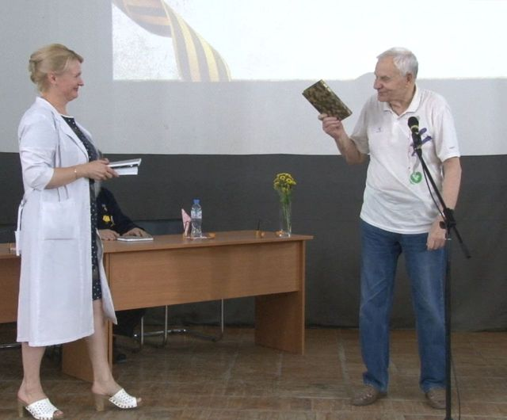</a>

Юрий Александрович Торгашов рассказал о бессмертном подвиге бойцов 10-ой дивизии НКВД, которые защищали Сталинград с
    первых дней до последнего дыхания, но не пропустили врага.

Ю.А.Торгашов вручает книгу и.о. начальника госпиталя Максимовой Ольге Станиславовне.

    <a href="img/26.10.2016/37.jpg" target="_blank">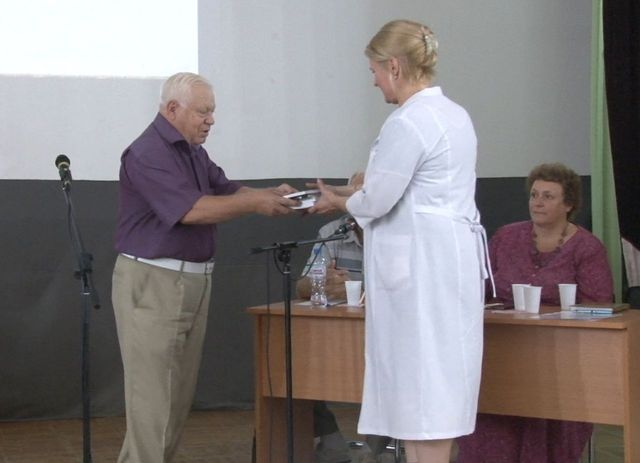</a>

 

Очень интересным и показательным стало выступление пациента госпиталя (проходил в это время лечение) нашего «старшего
    брата», участника битвы за Сталинград, Владимира Семёновича Турова - Президента клуба «Сталинград».

Владимир Семёнович особо отметил важность таких встреч поколений, когда живые свидетели передают историю Сталинграда
    и рассказывают младшим поколениям, какой ценой нам досталась Сталинградская Победа. Он вручил руководителю
    организации «Дети Сталинграда» Г.А.Дубоносову свою книгу «Чтобы помнили», а Г.А.Дубоносов вручил ему свою «Судьба
    Сталинградца».

    

Интересно, что Г.А. Дубоносов был пациентом Госпиталя (в Сарепте) в июне 1943 года после ранения (взрыв боеприпаса) и
    вот теперь в Госпитале встретились и обнялись два ветерана: старший и младший.

Это и есть живая связь сталинградских поколений.

Прозвучали на этой замечательной «встрече» стихи и песни о войне и главное - наш гимн «Поклонимся великим тем
    годам...»

Исполнители-представители младших поколений сталинградцев.

На экране были показаны отдельные фрагменты мероприятий организации, в том числе встреча с французской делегацией в
    Доме ветеранов 13 ноября 2015 года, где руководитель делегации Патрик Бенсимон отметил важнейшее международное
    значение Сталинградской Победы, подарил нам прекрасно оформленное издание о «зверствах фашизма», факты о которых они
    собирают и представляют миру.

    

        <button type="button" data-bs-target="#carouselExampleIndicators9" data-bs-slide-to="0" class="active"
            aria-current="true" aria-label="Slide 1"></button>
        <button type="button" data-bs-target="#carouselExampleIndicators9" data-bs-slide-to="1"
            aria-label="Slide 2"></button>
        <button type="button" data-bs-target="#carouselExampleIndicators9" data-bs-slide-to="2"
            aria-label="Slide 3"></button>
    

    

        

            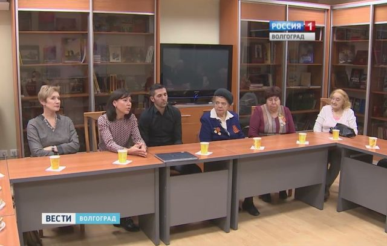
        

        

            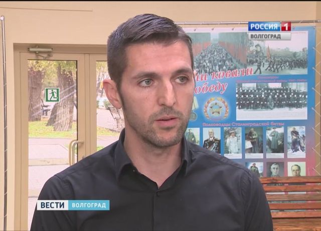
        

        

            
        

    

    <button class="carousel-control-prev" type="button" data-bs-target="#carouselExampleIndicators9"
        data-bs-slide="prev">
        
        Previous
    </button>
    <button class="carousel-control-next" type="button" data-bs-target="#carouselExampleIndicators9"
        data-bs-slide="next">
        
        Next
    </button>

В организации «Дети Сталинграда ведётся постоянная работа по всем Уставным направлениям деятельности.

Президиум живёт и работает.

А <a href="doc/project_sberech_chest.pdf" target="_blank">Проект «Сбережём Честь и Славу Сталинграда»</a> будет
    пополняться «Программами» и действовать к 75 годовщине Сталинградской Победы и далее!
